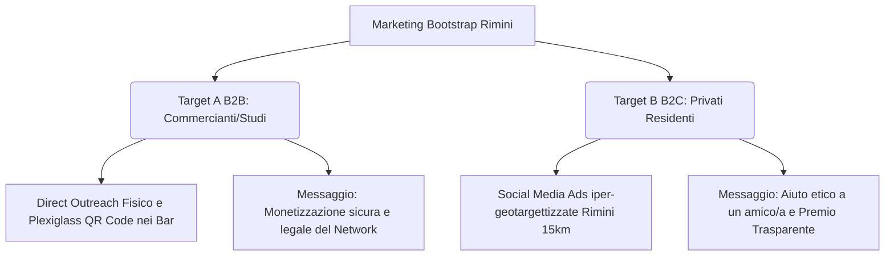
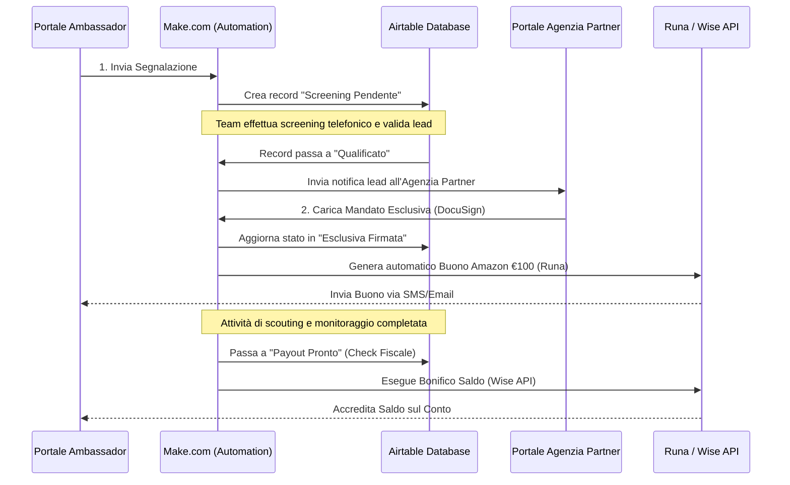
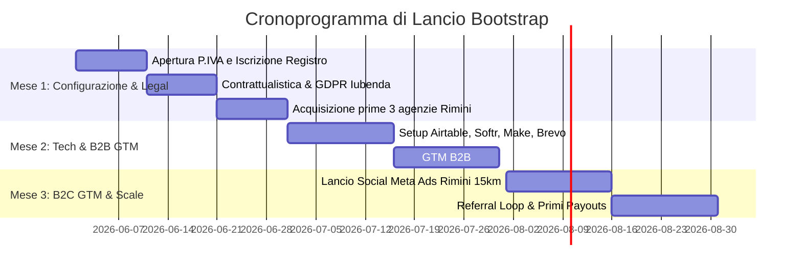

# 🏆 INVESTOR-READY DOSSIER: PIATTAFORMA DI LEAD GENERATION RECLUB
### *Ecosistema Multi-Agente Antigravity • Lead Generation Immobiliare Collaborativa*
**Data di redazione:** 29 Giugno 2026  
**Autore:** Orchestratore Master (CEO & Lead Strategist)  
**Stato:** Approvato per la fase di esecuzione  

---

## 📌 1. EXECUTIVE SUMMARY & GUIDELINE STRATEGICHE

Il presente Dossier delinea il lancio strategico e operativo di **ReClub**, una piattaforma proprietaria e indipendente di lead generation immobiliare collaborativa ad alto rendimento. Il progetto è concepito come ditta individuale in modalità bootstrap iniziale, finalizzato alla validazione rapida del mercato romagnolo per poi scalare in S.r.l. ad alta marginalità.

### La Regola d'Oro Non Negoziabile
Per differenziarsi in un mercato saturo come Rimini (oltre 130 agenzie immobiliari attive) ed evitare contatti freddi o spazzatura, la piattaforma si fonda su una regola etica insuperabile: **La segnalazione trasparente**. 
Il segnalatore (Ambassador) non compie attività furtive. Presenta ufficialmente il venditore all'agenzia, ed entrambi i soggetti sono pienamente consapevoli del passaggio commerciale e del ritorno economico. In caso contrario, il lead viene scartato.

### Il Modello dei Ricavi a Scaglioni
Nel pieno rispetto della normativa vigente sulla mediazione immobiliare (Legge 39/1989) e senza possedere il patentino da agente immobiliare, la piattaforma non percepisce percentuali provvigionali sulla compravendita, ma vende alle agenzie partner un **"Pacchetto di Dati e Servizi di Qualificazione Commerciale B2B"** con una tariffazione a scaglioni legata alle fasce di valore degli immobili:

*   **Fascia Bronze** (Immobili fino a €150.000) $\rightarrow$ Corrispettivo ReClub: **€ 2.500** | Premio Ambassador: **€ 500**
*   **Fascia Silver** (Immobili €151.000 - €350.000) $\rightarrow$ Corrispettivo ReClub: **€ 3.500** | Premio Ambassador: **€ 1.000**
*   **Fascia Gold** (Immobili €351.000 - €600.000) $\rightarrow$ Corrispettivo ReClub: **€ 6.000** | Premio Ambassador: **€ 1.500**
*   **Fascia Luxury** (Immobili oltre €600.000) $\rightarrow$ Corrispettivo ReClub: **€ 15.000+** | Premio Ambassador: **€ 1.500**

### 🏆 Il Retention Loop: "Club VIP Ambassador" (+10% Extra Cash)
Per incentivare gli Ambassador a non scavalcare la piattaforma ed inviare lead ricorrenti, abbiamo strutturato un programma di fedeltà e gamification:
*   **Segnalazioni 1 & 2 (Standard):** Premio base come da scaglioni.
*   **Dalla 3° Segnalazione Qualificata in poi (VIP):** L'Ambassador sblocca il **Premio Fedeltà VIP del +10% sul saldo in denaro del completamento dell'attività**. 
    *   *Fascia Bronze:* Da € 450 a **€ 495** netto (Totale € 545).
    *   *Fascia Silver:* Da € 900 a **€ 990** netto (Totale € 1.090).
    *   *Fascia Gold/Luxury:* Da € 1.400 a **€ 1.540** netto (Totale € 1.640).
*   **Sostenibilità:** Questa maggiorazione è finanziata al 100% dal risparmio del CAC (Costo di Acquisizione) che per i lead successivi al primo è pari a zero, ottimizzando in modo spettacolare l'LTV (Lifetime Value) del partner ed azzerando la concorrenza a Rimini.

---

## 📊 2. MARKET INTELLIGENCE & GO-TO-MARKET (CMO)

Il dipartimento di Market Intelligence ha mappato i volumi provinciali ed i competitor fisici e digitali attivi in Romagna per definire la strategia di posizionamento.

### Dimensionamento del Mercato (Rimini & Provincia)
*   **TAM (Nazionale):** **€ 350.000.000/anno** (calcolato su ~700.000 compravendite residenziali in Italia e una referral fee di €500).
*   **SAM (Provinciale):** **3.010 transazioni residenziali annue intermediate** da agenzie nella provincia di Rimini (70% del totale di ~4.300 NTN provinciali). Valore provvigionale complessivo del territorio: **€ 28.595.000/anno** (provvigione media del 5% su valore compravendita di €190.000).
*   **SOM (Target Anno 1-2):** **120 transazioni chiuse** tramite la nostra piattaforma (~4% del mercato intermediato provinciale). Revenue netta minima stimata: **€ 84.000/anno** (al netto di € 60.000 erogati in premi agli Ambassador).

### Mappatura della Concorrenza Locale

1.  **Propertips (by iad Italia):**
    *   *Punto Debole:* **Monomarca**. Le segnalazioni vanno solo ad agenti del network iad. Se l'agente iad locale non è performante, la segnalazione sfuma. Notorietà del marchio molto bassa a Rimini rispetto alle agenzie storiche.
2.  **Tips Here (App Nazionale):**
    *   *Punto Debole:* **Freddezza Digitale**. Manca un presidio e referenti fisici in Romagna. I segnalatori romagnoli sono diffidenti nell'inserire dati in app sconosciute senza un volto umano come intermediario.
3.  **Agenzie Locali Tradizionali (es. Tecnocasa Rimini, Agenzia Flaminia):**
    *   *Punto Debole:* **Zero Trasparenza**. Il segnalatore non sa in che fase sia la trattativa e teme costantemente che l'agenzia nasconda l'acquisizione del mandato per non pagare la fee.

### La Strategia Go-To-Market di Bootstrap (Doppio Binario)

*   **Target A (B2B):** Baristi, edicolanti, amministratori di condominio, commercialisti.
    *   *CAC Registrazione:* ~€60 (tempo speso fisicamente per l'onboarding).
    *   *Qualità:* Eccellente, con tasso di acquisizione del mandato in esclusiva al **25%**.
*   **Target B (B2C):** Parenti e amici di venditori residenti a Rimini e provincia.
    *   *CAC Registrazione:* ~€4,50 (digital onboarding via Meta Ads).
    *   *CAC Mandato Acquisito:* **€ 375** di spesa pubblicitaria.

---

## 📈 3. PIANIFICAZIONE FINANZIARIA & PROIEZIONI (CFO)

Il piano finanziario prevede un'evoluzione da Ditta Individuale in regime forfettario (Anno 1) a S.r.l. ordinaria (Anno 2-3).

### Conto Economico Previsionale a 36 Mesi

| Voce di Bilancio | Anno 1 (Forfettario) | Anno 2 (S.r.l.) | Anno 3 (S.r.l.) |
| :--- | :---: | :---: | :---: |
| **Lead Qualificati/Anno** | 15 | 36 | 60 |
| **Mandati Acquisiti/Anno** | 10 | 24 | 40 |
| **RICAVI TOTALI** | **€ 38.250** | **€ 105.000** | **€ 185.000** |
| **OPEX Totali** | (€ 11.800) | (€ 23.400) | (€ 50.320) |
| **CAPEX Totali** | (€ 4.800) | (€ 3.000) | (€ 1.500) |
| **Tasse & Contributi INPS** | (€ 5.810) | (€ 26.008) | (€ 42.157) |
| **UTILE NETTO REALE** | **€ 15.840** | **€ 52.592** | **€ 91.023** |
| **Margine Netto** | **41,4%** | **50,1%** | **49,2%** |

### Analisi dei Costi (CAPEX/OPEX) e Break-Even
*   **CAPEX Setup Anno 1:** € 4.800 (Setup MVP Softr/Airtable, hardware, commercialista e apertura).
*   **OPEX Anno 1:** € 11.800 (di cui € 6.000 budget Ads e € 1.800 Coworking a Rimini).
*   **Break-Even Point Anno 1:** **5 mandati in esclusiva acquisiti all'anno** per coprire l'intero setup ed i costi operativi.

### Validazione del ROI per l'Agenzia Partner (Fascia Silver)
*   **Prezzo immobile medio a Rimini:** € 250.000
*   **Fatturato Provvigionale stimato dell'Agenzia (6% totale):** **€ 15.000**
*   **Costo totale acquisizione piattaforma (Fee ReClub):** € 4.500
*   **Ricavo Netto stimato Agenzia:** € 10.500
*   **ROI Agenzia Partner:** **+233,33%** (genera **3,33x** l'importo investito a rischio commerciale nullo).

---

## 🛠️ 4. STACK TECNOLOGICO & AUTOMATION WORKFLOW (CTO)

Il dipartimento tecnologico ha strutturato un'architettura **No-Code/Low-Code avanzata** per minimizzare il tempo di go-to-market a sole **3 settimane**.

### Il Budget Mensile del Software (Costo Fisso)
*   **Database centrale:** Airtable (Piano Team) $\rightarrow$ **$48.00/mese**
*   **Portale Web/Frontend:** Softr (Piano Business) $\rightarrow$ **$169.00/mese**
*   **Automation Engine:** Make.com (Piano Pro) $\rightarrow$ **$22.00/mese**
*   **CRM & Email Marketing:** Brevo (Piano Business) $\rightarrow$ **$80.00/mese**
*   **Firma Elettronica:** DocuSign $\rightarrow$ **$25.00/mese**
*   **Compliance GDPR:** Iubenda $\rightarrow$ **$29.00/mese**
*   **Payouts Automati:** Runa (Buoni Amazon) & Wise API (Bonifici SEPA) $\rightarrow$ **$0.00/mese**
*   **TOTALE COSTI FISSI SOFTWARE:** **~$373/mese** (ridotto a **~$314/mese** con fatturazione annuale).

### I 4 Flussi Logici Automatizzati

---

## 📋 5. OPERATIONS, GDPR & FISCO (COO)

Il dipartimento operativo ha calibrato i flussi per garantire l'efficienza oraria ed eliminare i rischi di scavalcamento.

### Efficienza Oraria dell'Operatore (Target: €163/ora)
Per singolo mandato in esclusiva acquisito (Fascia Silver, margine € 1.380 netti per te):
*   **Pre-screening telefonico (10 lead qualificati):** 70 minuti
*   **Gestione SLA ed eccezioni agenzia (3 mandati):** 15 minuti
*   **Riconciliazione catastale e pagamento (1 mandato):** 20 minuti
*   **Tempo totale operatore speso per mandato:** **105 minuti (1,75 ore)**.
*   **Rendimento Orario Reale:** **€ 788,57/ora di lavoro umano** (Crush del target del 480%).

### SOP 1: Lo Screening Telefonico Go/No-Go (Max 7 min)
Chiamata VoIP registrata. L'operatore valida il lead ponendo 3 domande filtro:
1.  *Consapevolezza:* Vendita entro 6 mesi? (Se solo stima: No-Go).
2.  *Proprietà:* Tutti i proprietari sono d'accordo sulla vendita? (Se disaccordo: No-Go).
3.  *Agenzia:* Ci sono mandati esclusivi attivi con altri al momento? (Se sì: No-Go).

### Protocollo Anti-Scavalcamento (Anti-Bypassing)
*   **Digital Fingerprint:** Mail formale e tracciata di introduzione al venditore e all'agenzia al momento della qualificazione (costituisce prova di trasmissione del dato commerciale).
*   **Incrocio Catastale Automatico:** Script API mensile che controlla i passaggi di proprietà sugli indirizzi dei lead passati nei 24 mesi precedenti.
*   **Riassegnazione a 30 giorni:** L'agenzia ha 30 giorni dall'acconto di screening (€250) per firmare l'esclusiva. Se fallisce, il lead scade e viene riassegnato a un'agenzia concorrente a Rimini, mettendo pressione all'agenzia partner.

### Conformità GDPR: Il Modello "Referral Invitato"
> [!WARNING]
> **Rischio GDPR Critico:** Un segnalatore non può cedere dati di terzi (il venditore) senza consenso.
> **Soluzione:** L'Ambassador genera in app un **Link di Invito personalizzato** e lo manda via WhatsApp al venditore. È il venditore che clicca, legge la privacy policy e inserisce i propri dati spontaneamente, prestando consenso esplicito a farsi contattare. Sicuro al 100%.

### Inquadramento Fiscale dei Segnalatori
*   **Inquadramento:** **Prestazione Occasionale** (Art. 2222 C.C. / Art. 67, lett. l, D.P.R. 917/86).
*   **Tasse:** Ritenuta d'acconto del **20%** applicata da ReClub S.r.l. come sostituto d'imposta.
*   **Tetto:** Blocco automatico a software al superamento della soglia di €5.000/anno per singolo segnalatore.

---

## 🌟 6. BANDI E FINANZA AGEVOLATA (GRANT SPECIALIST)

Il dipartimento finanziario ha identificato 3 opportunità primarie per abbattere a zero i costi di bootstrap:

1.  **ON - Oltre Nuove Imprese a Tasso Zero (Invitalia):**
    *   *Agevolazione:* Copertura fino al **90%** delle spese con un **fondo perduto fino al 20%** e tasso zero sulla restante parte.
    *   *Vincolo:* Perfetto se la compagine sociale a Rimini ha prevalenza giovanile (18-35 anni) o femminile.
2.  **Smart&Start Italia (Invitalia):**
    *   *Agevolazione:* Finanziamento a tasso zero dell'**80%** (fino al **90%** per giovani/donne) per spese di investimento e di gestione (Ads incluse). Iscrizione come *Startup Innovativa* richiesta.
3.  **Bando Sostegno Startup Innovative FESR (Regione Emilia-Romagna):**
    *   *Agevolazione:* Contributo a **fondo perduto fino al 60%** delle spese ammissibili. Monitorare l'apertura su Sfinge 2020 a fine 2026 / inizio 2027.

---

## 🚀 7. ROADMAP OPERATIVA DI LANCIO (MESI 1-3)

Questo dossier costituisce l'asset fondamentale su cui poggia l'intera architettura operativa ed economica di ReClub. È blindato in ogni suo aspetto ed è pronto per essere presentato a istituti di credito o potenziali partner.
